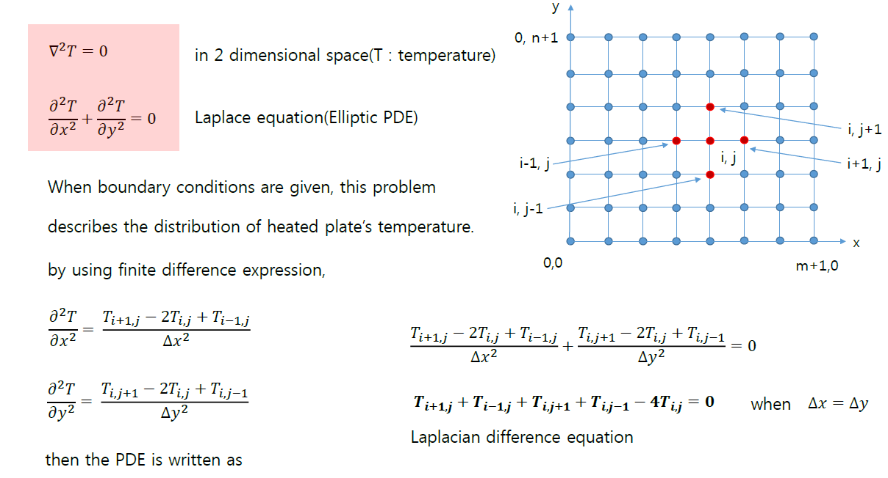
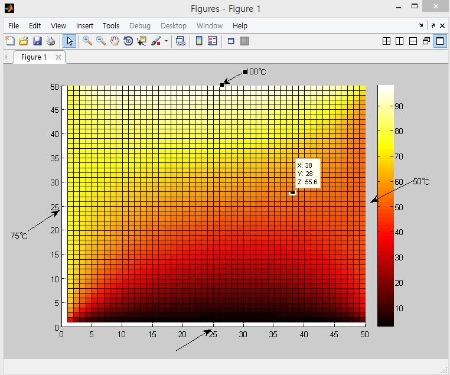

# pde_by_FDM
C-based solution of an elliptic partial differential equation (PDE) by finite difference method (FDM). The code solves 2D elliptic PDE with given boundary condition, describing the temperature distribution of heated plate. 

 

------

- result:

 

